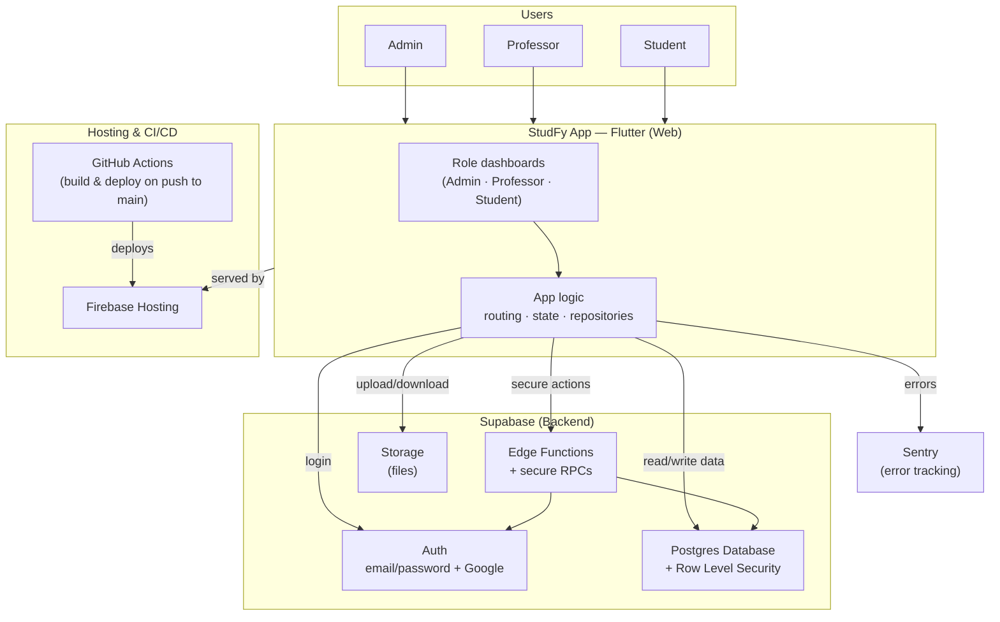
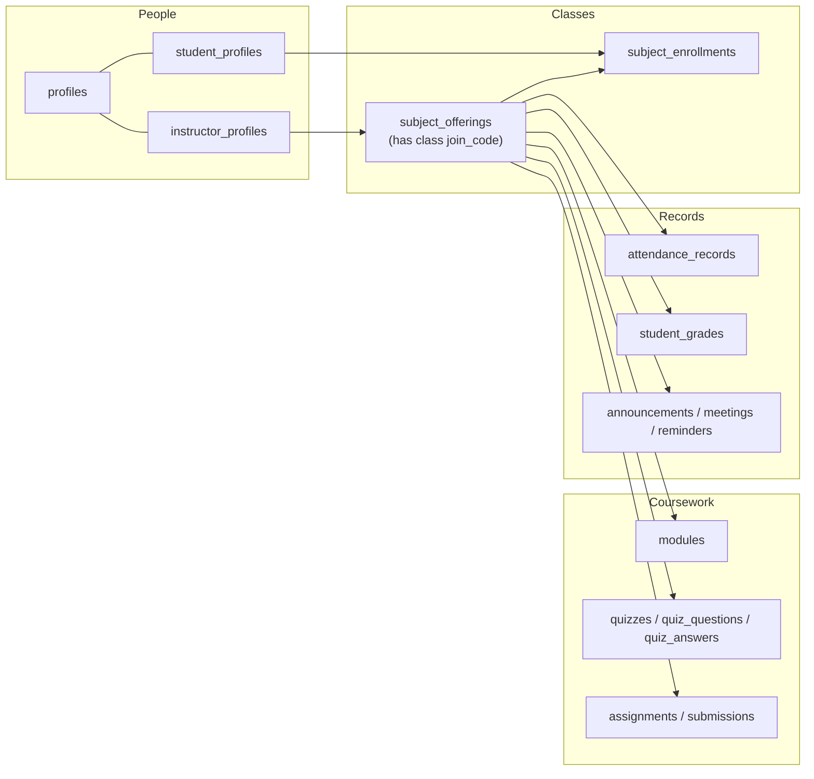

# StudFy — System Architecture Overview

StudFy is a university LMS (single-semester) for **Admins**, **Professors**, and **Students**,
built with **Flutter** (web), hosted on **Firebase**, and powered by **Supabase**.

---

## Overall Architecture

---

## What each role does

| Role | Can do |
|------|--------|
| **Admin** | Create/manage students, instructors, subjects; generate registration codes; approve role requests |
| **Professor** | Create classes (with a join code), post modules/quizzes/assignments, take attendance, grade, post announcements & meetings |
| **Student** | Join classes by code, view modules, take quizzes, submit assignments, view grades & attendance |

---

## What the backend provides

| Supabase service | Used for |
|------------------|----------|
| **Auth** | Login (email/password + Google); admin-created accounts must reset password on first login |
| **Database (Postgres + RLS)** | All records; Row Level Security ensures each role sees only what it should |
| **Edge Functions** | Admin-only actions: create/update/delete users, bulk import, resolve requests |
| **Secure RPCs** | Sensitive logic: server-side quiz scoring, class join codes, registration codes |
| **Storage** | Module materials, assignment files, and submissions |

---

## Main data (Postgres tables)

---

## How it ships

1. Code is pushed to **GitHub**.
2. On push to **main**, **GitHub Actions** builds the Flutter web app and deploys it to
   **Firebase Hosting** (`studfy-e92cd.web.app`).
3. The live app talks directly to **Supabase** for auth, data, functions, and files.

---

### Key points
- **3 roles**, each with its own dashboard and access rules (enforced by database Row Level Security).
- **Two kinds of codes**: a **Registration Code** (admin onboards an account) and a **Class Code** (student joins a specific class, like Google Classroom).
- **Quizzes are scored on the server** so correct answers are never exposed to students.
- **Single-semester scope** by design.
